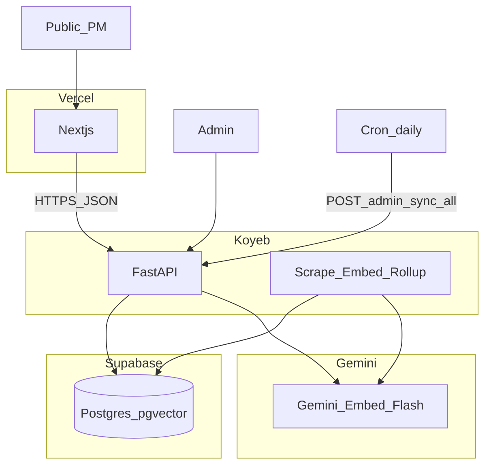
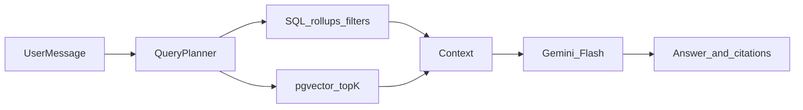

# App Review Intelligence — Architecture (v1)

**Canonical specification.** All implementation must follow this document.

**Project root:** `C:\Users\Ajeya Siddhartha\Projects\app-review-intelligence`

---

## 1. Product summary

Public web app for Product Managers: browse a **curated catalog** (max **15 active** apps), view rating/sentiment trends, and ask natural-language questions with **citations** over pre-scraped **Google Play** and **Apple App Store** reviews.

| Actor | Access |
|--------|--------|
| **Public** | Catalog, trends, chat — no login |
| **Admin** | Add / delete / replace apps, trigger scrape — FastAPI `/docs` + `X-Admin-Key` only |

**Not in v1:** Public scrape-on-search, user accounts, Reddit/social, official store developer APIs, Redis, Celery, Qdrant, Ollama, OpenAI, Next.js admin UI.

---

## 2. Tech stack

| Layer | Technology | Hosting |
|--------|------------|---------|
| **Frontend** | Next.js (App Router), React, Tailwind, Recharts, optional shadcn/ui | **Vercel** |
| **Backend** | Python 3.11+, FastAPI | **Koyeb** (always-on) |
| **Database** | PostgreSQL + **pgvector** | **Supabase** (dedicated project, separate from n8n) |
| **Embeddings** | Google Gemini `gemini-embedding-001`, **1536** dimensions | Gemini API |
| **Chat LLM** | Google Gemini `gemini-2.0-flash` | Gemini API |
| **Scrapers** | `google-play-scraper`, `app-store-scraper` (PyPI) | Koyeb (background jobs) |
| **Sentiment** | **Gemini bulk** on review text (`gemini-2.0-flash`, structured JSON per batch) | Gemini API |
| **Admin UI** | FastAPI Swagger **`/docs`** | Koyeb |
| **Background sync** | Daily **cron** → `POST /admin/sync-all`; on-demand **`POST /admin/apps/{id}/refresh`** | Koyeb or external cron |

**Excluded:** Oracle VM, local Ollama, Redis/Celery, Qdrant, Lovable/Replit hosting.

---

## 3. Capacity limits

| Parameter | Value |
|-----------|--------|
| **Max active apps** | **15** |
| **Max reviews per catalog app** | **2000 latest** (by `review_date`, **combined** Play + iOS — not 2000 per store) |
| **Max theoretical review rows** | 15 × 2000 = **30,000** |

### Supabase free tier (500 MB)

| Scenario | Estimated size | Verdict |
|----------|----------------|---------|
| 15 × 2000 reviews, ~80% with text + 1536-dim vectors | ~360–450 MB | **Fits** with prune + monitoring |
| 2000 **per store** per app (up to 60k rows) | ~720 MB+ | **Does not fit** |

**Required:** After each sync, **prune** each `catalog_app_id` to the **2000 most recent** reviews (delete older rows). Skip embedding for rating-only (empty text) reviews.

**Break threshold (all apps):** ~35k–40k embedded reviews on free tier. Cap of 30k is intentionally below that.

---

## 4. System architecture



### Component responsibilities

| Component | Responsibility |
|-----------|----------------|
| **Next.js (Vercel)** | Catalog UI, trend charts, chat UI, citations display |
| **FastAPI (Koyeb)** | Public API, admin API, chat orchestration, trigger background sync |
| **Background jobs (Koyeb)** | Scrape, prune, embed, rollups — not in HTTP request thread |
| **Supabase** | Persistent reviews, vectors, rollups, catalog |
| **Gemini** | Embeddings, **bulk sentiment**, chat answers |
| **Cron** | Daily incremental sync for all active apps |

---

## 5. Catalog policy

- Maximum **15** apps with `is_active = true` — reject `POST /admin/apps` if at limit.
- **Replace app:** `DELETE /admin/apps/{id}?purge=true` → `POST /admin/apps` → `POST /admin/apps/{id}/refresh`.
- Each catalog entry: `country` (required) + `play_package` and/or `ios_app_id`.
- Public catalog: only `is_active = true` AND `scrape_status = ready`.

---

## 6. Data model (Supabase)

### 6.1 `catalog_apps`

| Column | Type | Notes |
|--------|------|--------|
| `id` | UUID PK | |
| `display_name` | TEXT | From store metadata |
| `country` | CHAR(2) | e.g. `us`, `in` |
| `play_package` | TEXT NULL | e.g. `com.spotify.music` |
| `ios_app_id` | TEXT NULL | Numeric App Store id |
| `is_active` | BOOLEAN | |
| `scrape_status` | TEXT | `pending`, `running`, `ready`, `failed` |
| `last_synced_at` | TIMESTAMPTZ | |
| `review_count` | INT | Denormalized |
| `created_at` | TIMESTAMPTZ | |

At least one of `play_package`, `ios_app_id` must be set.

### 6.2 `reviews`

| Column | Type | Notes |
|--------|------|--------|
| `id` | UUID PK | |
| `catalog_app_id` | UUID FK | |
| `platform` | TEXT | `play_store`, `app_store` |
| `platform_review_id` | TEXT | Dedupe |
| `rating` | SMALLINT | 1–5 |
| `title`, `body` | TEXT | |
| `review_date` | DATE | |
| `language` | TEXT NULL | |
| `app_version` | TEXT NULL | |
| `sentiment_label` | TEXT | From Gemini text analysis (`positive`, `neutral`, `negative`) |
| `sentiment_score` | FLOAT | **-1.0 to 1.0** from Gemini; NULL if no review text |
| `embedding` | vector(1536) NULL | NULL if no review text |
| `scraped_at` | TIMESTAMPTZ | |

**Unique:** `(catalog_app_id, platform, platform_review_id)`

**Embeddings (one per review):**

- Input: `f"{title}. {body}".strip()` with tokenizer truncation to model max length.
- **Do not embed** empty or rating-only reviews (`embedding = NULL`).
- Store reviews without text for rating/trend aggregates.

### 6.3 `daily_rollups`

| Column | Type |
|--------|------|
| `catalog_app_id` | UUID FK |
| `date` | DATE |
| `review_count` | INT |
| `avg_rating` | FLOAT |
| `avg_sentiment` | FLOAT |
| `star_1` … `star_5` | INT |

**Primary key:** `(catalog_app_id, date)`

### 6.4 Indexes

- `reviews(catalog_app_id, review_date DESC)`
- `reviews(catalog_app_id, rating)` where needed
- **HNSW** on `reviews.embedding` WHERE `embedding IS NOT NULL`

### 6.5 Database access

- Backend uses **Supabase service role key** only.
- **Never** expose service key in Next.js client or public env.

### 6.6 Sentiment analysis (Gemini bulk)

**Do not** derive sentiment from star rating alone. Use review **text** (title + body).

| Item | Specification |
|------|----------------|
| **Model** | `gemini-2.0-flash` (same family as chat; structured output) |
| **Input per review** | `review_id`, `rating` (context only), `text` = `f"{title}. {body}".strip()` |
| **Batch size** | Configurable (e.g. 20–50 reviews per API call); respect token limits |
| **Output per review** | `sentiment_score` float **-1.0 … 1.0**, `sentiment_label` one of `positive`, `neutral`, `negative` |
| **Rating-only** | No API call; `sentiment_score` and `sentiment_label` remain **NULL** |
| **Retries** | Exponential backoff on 429/5xx; log batch failures to `logs/` |
| **Idempotency** | Re-run sentiment on changed text hash or after re-scrape |

Prompt must instruct the model to judge **text tone**, not copy the star rating into the score.

---

## 7. Ingestion pipeline

### Triggers

| Trigger | Action |
|---------|--------|
| `POST /admin/apps/{id}/refresh` | Background sync for one app |
| `POST /admin/sync-all` (cron daily) | Incremental sync all active apps |
| After `POST /admin/apps` | Admin should call `refresh` for new app |

### Per-app sync steps

1. Set `scrape_status = running`
2. Scrape Play and/or iOS (paginate; respect rate limits)
3. Upsert reviews (dedupe by unique key)
4. **Prune** to **2000 latest** rows per `catalog_app_id` (by `review_date`)
5. **Sentiment (Gemini bulk):** Send reviews **with text** in batches to Gemini; persist `sentiment_score` (-1..1) and `sentiment_label`. Rating-only rows: leave sentiment NULL.
6. **Embed** rows with text via Gemini embeddings (batch, backoff on 429)
7. Recompute `daily_rollups` (use `avg_sentiment` from Gemini scores where present; rating-only rows contribute to star counts / `avg_rating` only)
8. Set `scrape_status = ready`, update `last_synced_at` and `review_count`

### Rules

- Do **not** block HTTP until scrape completes — return **202 Accepted** or poll via `GET /admin/apps`.
- Prefer **one refresh at a time** on free Koyeb RAM.
- Config: `MAX_ACTIVE_APPS=15`, `MAX_REVIEWS_PER_APP=2000`.

---

## 8. API specification

### 8.1 Public endpoints

| Method | Path | Purpose |
|--------|------|---------|
| GET | `/catalog` | List active, ready apps |
| GET | `/apps/{id}` | App metadata, `last_synced_at`, `review_count` |
| GET | `/apps/{id}/trends` | Query: `from`, `to` → `daily_rollups` series |
| GET | `/apps/{id}/reviews` | Paginated reviews (optional for UI) |
| POST | `/apps/{id}/chat` | Body: `{ "message": "..." }` → answer + citations |

### 8.2 Admin endpoints (header: `X-Admin-Key`)

| Method | Path | Purpose |
|--------|------|---------|
| POST | `/admin/apps` | Add app; reject if 15 active |
| DELETE | `/admin/apps/{id}?purge=true` | Delete app + cascade reviews + rollups |
| POST | `/admin/apps/{id}/refresh` | Start background sync |
| POST | `/admin/sync-all` | Sync all active apps (cron) |
| GET | `/admin/apps` | All apps with `scrape_status`, counts |

**Admin UX:** `https://<koyeb-host>/docs`

### 8.3 Chat response shape

```json
{
  "answer": "Natural language summary.",
  "metrics": {
    "review_count": 42,
    "avg_sentiment": 0.15
  },
  "citations": [
    {
      "review_id": "uuid",
      "platform": "play_store",
      "rating": 2,
      "review_date": "2026-03-01",
      "snippet": "..."
    }
  ]
}
```

---

## 9. Chat / RAG (hybrid — required)

**Never answer trend-only questions from vectors alone.**



| Question type | Primary engine |
|---------------|----------------|
| Sentiment / trends over weeks or months | SQL on `daily_rollups` + aggregates |
| "What are users saying about X in week Y?" | pgvector + date/`catalog_app_id` filters |
| Final narrative | Gemini Flash with citation instructions |

---

## 10. Frontend (Next.js on Vercel)

### Routes

| Route | Purpose |
|-------|---------|
| `/` | Landing + catalog grid (max 15 apps) |
| `/apps/[id]` | Trends charts + chat panel + citations |

### Environment

- `NEXT_PUBLIC_API_URL=https://<koyeb-api-host>`

### Frontend does

- Fetch catalog, trends, chat from API
- Render Recharts trend lines
- Show chat thread, loading states, citation cards
- Display `last_synced_at` and `review_count`

### Frontend does not

- Scrape stores, call Gemini, access Supabase, or admin mutations

### CORS

FastAPI allows Vercel production URL and preview URLs (`*.vercel.app`).

**No `/admin` routes in Next.js.**

---

## 11. Repository layout

```text
app-review-intelligence/
  docs/
    ARCHITECTURE.md       # this file
  backend/                # FastAPI (Phase 1+)
    app/
    requirements.txt
    Dockerfile
  frontend/               # Next.js (Phase 5)
  supabase/
    migrations/           # SQL schema, pgvector
  .env.example
  README.md
```

---

## 12. Implementation phases

| Phase | Deliverable |
|-------|-------------|
| **1** | Supabase schema; admin CRUD; scrape + prune 2000; Gemini bulk sentiment; deploy FastAPI to Koyeb |
| **2** | Gemini embeddings; pgvector HNSW index |
| **3** | `daily_rollups`; `GET /apps/{id}/trends` |
| **4** | Hybrid chat: `POST /apps/{id}/chat` |
| **5** | Next.js on Vercel: catalog, charts, chat |
| **6** | Daily cron; enforce 15-app cap; logging and failed-scrape visibility |

---

## 13. Admin: replace app workflow

1. `DELETE /admin/apps/{old_id}?purge=true`
2. `POST /admin/apps` with new `play_package` / `ios_app_id` + `country`
3. `POST /admin/apps/{new_id}/refresh`
4. Wait until `scrape_status = ready`
5. App appears on public catalog (Vercel)

---

## 14. Environment variables

### Koyeb (backend)

```text
SUPABASE_URL=
SUPABASE_SERVICE_ROLE_KEY=
GEMINI_API_KEY=
ADMIN_API_KEY=
MAX_ACTIVE_APPS=15
MAX_REVIEWS_PER_APP=2000
CORS_ORIGINS=https://your-app.vercel.app,https://*.vercel.app
```

### Vercel (frontend)

```text
NEXT_PUBLIC_API_URL=
```

---

## 15. Security and compliance

| Item | Implementation |
|------|----------------|
| Admin | `X-Admin-Key` on all `/admin/*` routes |
| Secrets | Only on Koyeb / Vercel env — never in git |
| Public abuse | Optional IP rate limits on `/chat` (Phase 6) |
| Legal | Footer: public review data; not affiliated with Apple or Google |

---

## 16. Risks and mitigations

| Risk | Mitigation |
|------|------------|
| 2000 per store → 60k rows | Enforce **2000 total per catalog_app**; prune after sync |
| Supabase 500 MB full | Purge on delete; monitor dashboard; cap apps/reviews |
| Koyeb OOM on backfill | One job at a time; cap 2000; background task |
| Gemini 429 | Batch sentiment + embed; exponential backoff |
| Scraper breakage | `scrape_status=failed`; manual refresh via `/docs` |

---

## 17. Locked decisions checklist

- [x] Max **15** active apps; replace via purge + add
- [x] Max **2000 latest reviews per app** (combined stores); **prune after sync**
- [x] Supabase pgvector, 1536-dim Gemini embeddings
- [x] Koyeb + cron/refresh; **no Redis/Celery**
- [x] Gemini Flash for chat and **bulk text-based sentiment**
- [x] Next.js on **Vercel**; admin via **FastAPI `/docs` only**

---

## 18. Reference for implementation prompts

When building any feature, verify against:

1. Catalog limit **15**; purge on delete
2. **Pre-scraped only** — no public scrape trigger
3. **Hybrid chat** — SQL for trends, pgvector for semantic, Flash for answers
4. **One vector per review**; skip empty text
5. **Frontend** = Next.js/Vercel; **backend** = FastAPI/Koyeb; **DB** = Supabase pgvector
