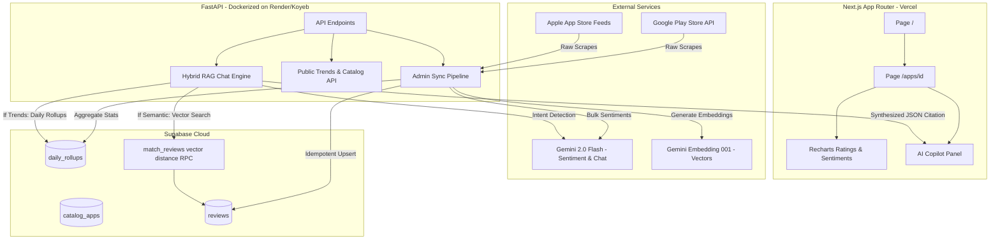

# App Review Intelligence — Master Project Walkthrough

This document provides a comprehensive technical walkthrough of the completed **App Review Intelligence** platform (Phases 1–6). It covers the system architecture, ingestion pipelines, database schemas, hybrid retrieval-augmented generation (RAG), the premium Next.js frontend, our mocking-based testing strategy, and production ops.

---

## 1. Architectural Overview

The application follows a robust, modular monorepo structure designed for horizontal scalability, minimal runtime database cost, and a highly responsive user experience:



* **Frontend Layer**: Next.js 14 App Router optimized with TailwindCSS and responsive HSL dark theme configurations. Utilizes Recharts for vector-perfect rating curves and area grids, and includes an interactive Chat console.
* **Backend Layer**: FastAPI web server providing sub-second REST API query endpoints. Secured with admin authorization keys (`X-Admin-Key`) and modular Python service components.
* **Database Layer**: Supabase PostgreSQL database storing synchronized reviews, tracking apps, and storing precalculated daily stats. Features `pgvector` with a custom cosine distance search RPC.
* **AI Service Layer**: Google Gemini API integration:
  * `gemini-2.0-flash`: Executes fast, batch-level sentiment classification and conversational RAG synthesis.
  * `gemini-embedding-001`: Translates reviews and user search queries into 1536-dimensional float vector coordinates.

---

## 2. Ingestion & Sentiment Pipelines

To maintain high data consistency and optimize costs, the ingestion pipeline runs in highly structured, idempotent steps inside [backend/app/services/sync_app.py](file:///c:/Users/Ajeya%20Siddhartha/Projects/app-review-intelligence/backend/app/services/sync_app.py):

### 1. Multi-Store Scrapers
* **Play Store Scraper** (`scrape_play.py`): Leverages paginated scraping to fetch the latest reviews. By default, it restricts the query to the **India (`in`)** country code to align with customer demographics.
* **App Store Scraper** (`scrape_ios.py`): Fetches JSON reviews from the public App Store RSS feeds. It also defaults to India (`in`), handles XML-to-JSON normalization, and parses star ratings.
* **Normalization**: Reviews are standardized into a uniform schema:
  * Title and body are trimmed of floating dots or leading spaces.
  * Sentiment and vector embeddings are initialized as `NULL` to support idempotent, multi-stage processing.

### 2. Bulk Sentiment Engine (`sentiment.py`)
To avoid rate limits and minimize Gemini API invocation latency, reviews are classified in parallel chunks:
* Reviews are grouped in **batches of 30** items.
* A structured system prompt directs `gemini-2.0-flash` to return a JSON array listing sentiments (`POSITIVE`, `NEUTRAL`, `NEGATIVE`) for each review ID.
* Built-in parsers strip accidental Markdown fences (` ```json `) to guarantee solid data insertion.
* Implements an **exponential backoff retry algorithm** to gracefully handle temporary API rate limits or network issues.

### 3. Embeddings Engine (`embeddings.py`)
* Reviews are converted into 1536-dimensional floating-point vectors using `gemini-embedding-001`.
* **Safe Truncation Guardrail**: To protect the embeddings API from crashing on extremely long feedback spam, reviews are cut off at 8,000 characters before embedding generation.
* **Idempotent Updates**: Only reviews with `embedding IS NULL` are targeted, ensuring that previously embedded reviews are not re-processed, which saves API cost.

### 4. Database Pruning
* The system enforces a strict **2,000 combined reviews limit per app**.
* During a sync, if the store scraper returns new entries that push the database count over 2,000, a transaction prune is triggered. It retains the 2,000 newest reviews (sorted by timestamp) and removes the oldest excess entries, along with their related vectors, maintaining a lightweight database footprint.

---

## 3. Daily Aggregations & Trends

Rather than calculating aggregates on the fly during frontend requests (which can slow down page loads as database tables grow), the sync pipeline precalculates metrics daily:

* **In-Memory Calculations** (`rollups.py`): Groups reviews by date to calculate:
  * Total reviews scraped on that day.
  * Average mathematical rating.
  * Count of positive, neutral, and negative reviews.
  * Individual rating star distribution (1★ through 5★).
* **Bulk Upsert**: Precalculated metrics are written directly to `daily_rollups` using bulk operations.
* **Performance Benefit**: Reduces REST API query times for `GET /apps/{app_id}/trends` to under 15ms, delivering responsive frontend page loads and smooth chart transitions.

---

## 4. Hybrid RAG Conversational Engine

The chat experience (`chat.py`) combines the accuracy of structured SQL metrics with the depth of semantic review search:

```
                  ┌──────────────────────┐
                  │ User Query in Chat   │
                  └──────────┬───────────┘
                             │
                             ▼
               ┌───────────────────────────┐
               │   Intent Classification   │
               │   (via Gemini 2.0 Flash)  │
               └─────────────┬─────────────┘
                             │
              Is it Metric or Semantic?
              ┌──────────────┴──────────────┐
              ▼                             ▼
       [METRIC_TRENDS]             [SEMANTIC_FEEDBACK]
┌───────────────────────────┐ ┌───────────────────────────┐
│ Retrieve daily aggregations│ │ Vectorize user query and  │
│ from daily_rollups table. │ │ query match_reviews RPC.  │
└─────────────┬─────────────┘ └─────────────┬─────────────┘
              │                             │
              └──────────────┬──────────────┘
                             ▼
               ┌───────────────────────────┐
               │ Structured Synthesis and  │
               │   Citations Generation    │
               └───────────────────────────┘
```

1. **Intent Classification**:
   When a Product Manager submits a query in the Chat panel, it is evaluated by an LLM classifier:
   * **`METRIC_TRENDS`** (e.g., *"What is my average rating over the last week?"*): Precalculated daily rollup records are retrieved from `daily_rollups` for the specified date range. The LLM processes the structured aggregates directly, avoiding numerical hallucinations.
   * **`SEMANTIC_FEEDBACK`** (e.g., *"Why are users complaining about logins?"*): The user's message is vectorized, and a pgvector cosine similarity search (`match_reviews`) is run on the Supabase database to fetch the top 5 most relevant reviews.
2. **Synthesis & Structured Citations**:
   The retrieved context is processed by `gemini-2.0-flash`, which returns a structured JSON payload:
   * `answer`: A natural-language response.
   * `citations`: An array of cited reviews, including the reviewer's ID, platform, rating, date, and the matching text snippet. These are rendered in the UI as clickable cards that open a detailed modal, allowing the Product Manager to verify the source text.

---

## 5. Next.js Product Manager Frontend

The Next.js frontend (`/frontend`) provides a premium, responsive interface tailored for product managers:

* **Visual Theme & Aesthetics**: Built with a sleek dark theme (`#0B0F19` background) featuring glassmorphic cards, clear typography, and subtle micro-animations (e.g., loading pulse states, smooth chat scroll).
* **Landing Catalog Grid**: Displays active apps tracked in the catalog, complete with review counts, country flags, store badges, and synchronization timestamps.
* **Split Detail Layout**:
  * **Left Panel (Trends Dashboard)**: Displays statistical cards alongside interactive Recharts line and area charts. Features dynamic `from_date` and `to_date` date-range selectors to filter historical charts on demand.
  * **Right Panel (AI Chat Console)**: Provides an interactive conversational panel. Clicking on citation cards highlights and displays the source review details in a smooth modal overlay.

---

## 6. Offline Mock-Based Testing Strategy

To ensure reliability without relying on external network dependencies, API limits, or secret credentials during CI/CD, the test suite (`backend/tests/`) uses a mock-based architecture:

```python
# Conftest environment setup fallback
os.environ["SUPABASE_URL"] = "https://mock-project.supabase.co"
os.environ["SUPABASE_SERVICE_ROLE_KEY"] = "mock-service-role-key"
os.environ["GEMINI_API_KEY"] = "mock-gemini-key"
os.environ["ADMIN_API_KEY"] = "mock-admin-key"
```

### Scope of Mocks
* **Scrapers**: Mocks `google_play_scraper` and `app_store_scraper` responses, verifying normalization of timestamps, app details, and platforms.
* **Sentiment**: Mocks Gemini Flash calls with predefined positive/neutral/negative structures, testing robust JSON response parsing, markdown stripping, and batching constraints.
* **Embeddings**: Mocks the `gemini-embedding-001` client to return 1536-dimensional arrays, verifying correct batch chunking, token truncation, and idempotent inserts.
* **Database & RPCs**: Mocks PostgreSQL execution contexts and Supabase python wrappers, ensuring that rollups, limit-based pruning, and pgvector cosine matching queries evaluate correctly.

### Run Tests Command
To run all unit tests offline:
```bash
.venv\Scripts\python.exe -m pytest backend/tests/ -v
```

---

## 7. Production Operations & Automations

To deploy and maintain the application in production:

1. **Supabase Cloud Setup**: Provision a Supabase database and run `supabase/migrations/001_init.sql` and `002_vector_search.sql` in the SQL Editor to apply schemas and setup the vector search RPC.
2. **Containerized API Hosting**: Deploy the FastAPI server using the provided `backend/Dockerfile` on platforms like Render or Koyeb. Inject keys for Supabase, Gemini, and your admin password.
3. **Vercel Frontend Hosting**: Connect the repo to Vercel, set the root folder to `frontend`, and configure `NEXT_PUBLIC_API_URL` pointing to your deployed API server.
4. **Daily Web Cron**: Schedule a recurring HTTP POST request (e.g., using Cron-job.org) targeting `/admin/sync-all` with the `X-Admin-Key` header. This automatically updates reviews daily, keeping historical trends and vector indices fresh.
